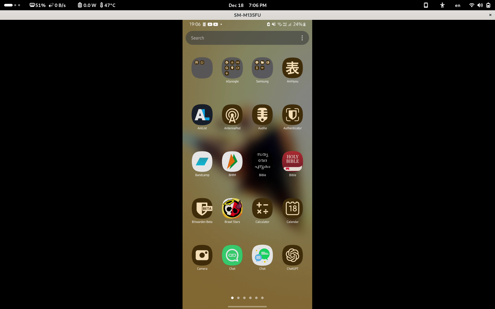

# scrcpy
scrcpy (screen copy) is a tool used for mirroring and controlling your Android device via ADB. I found this tool particularly useful when I cracked the display on my phone and touch did not work properly.

**To use scrcpy, you will need to enable USB Debugging on your device**

You can download scrcpy from [GitHub](https://github.com/Genymobile/scrcpy). To install it on Linux, see the following [page](https://github.com/Genymobile/scrcpy).

- To control the device using your keyboard and mouse (without Android Debugging). Use the following command.
```
scrcpy --otg
```

- To mirror the device and control the device, simply run the following command
```
scrcpy
```
- Use with the screen off
```
scrcpy --turn-screen-off --no-cleanup
```

[source](https://github.com/Genymobile/scrcpy/blob/0ba9d3570560cb46b52a0696134442aeb7f634e6/doc/device.md#turn-screen-off)
## Screenshot

