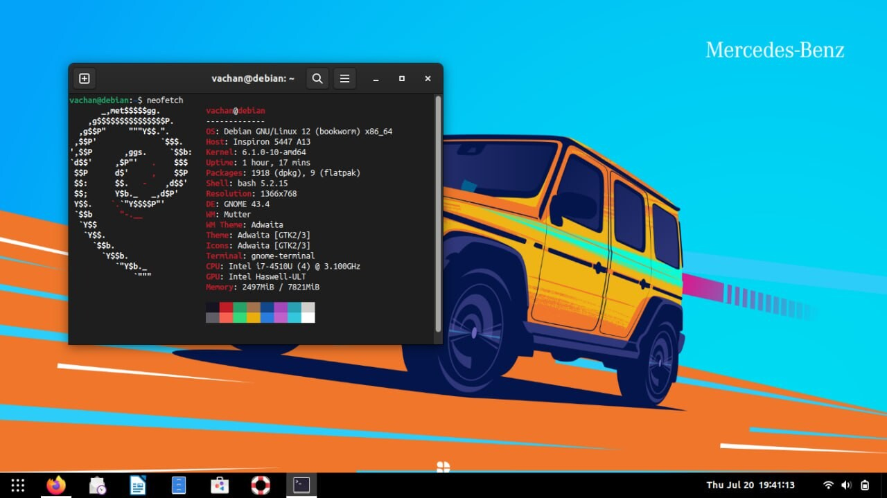
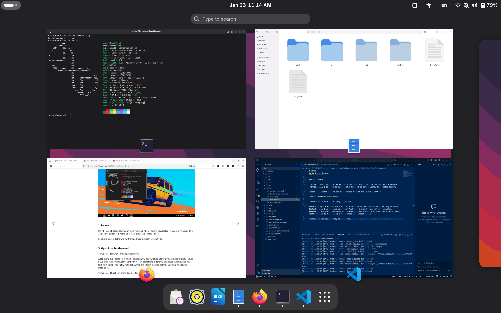

# Linux

## My Linux Journey

### 1. Debian

Debian is the first distro that I installed on my computer.

I got tired of Windows 10 and decided to switch to Debian 12 (bookworm) in the month of July of 2023. No dual-boot. Just only Debian.

I used a Dell Inspiron laptop at the time and the hardware worked really. 

Not only that Debian is a rock solid distro and I didn't face any big issues while using, everything worked well.

### 2. Fedora

I think I used Debian Bookworm for a year and when I got my new laptop - A Lenovo Thinkpad E16, I decided to switch to a more up to date distro. So I chose Fedora.

Fedora is a solid distro and my thinkpad worked really well with it.
 
 ### 3. OpenSuse Tumbleweed (Current Distro)

Tumbleweed is what I am using right now.

After trying out Fedora for a while, I decided why not switch to a rolling release distribution. I could have gone with Arch but I thought why not try something different? Opensuse Tumbleweed was something that I had in my mind for a while and I really wanted to try it. So I went ahead and installed it. 

Tumbleweed has been pretty good so far and I haven't faced any major issues so far. It's works pretty well considering it is a rolling release. 

## Desktop Environment
### Gnome

Gnome is the desktop environment of my choice. I love how clean, minimal and polished it is. Gnome just looks so good and I love the MacOS style it has.

Yes, I know how a lot of people just hate Gnome and I totally understand you guys. But I love gnome and it's enough for me. 

Yes, I have tried KDE Plasma but it's just full of way too many options and customizations that I really don't need. Whenever I installed Plasma, I always felt like going back and installing Gnome.

Yeah so Gnome is my favorite distro.

