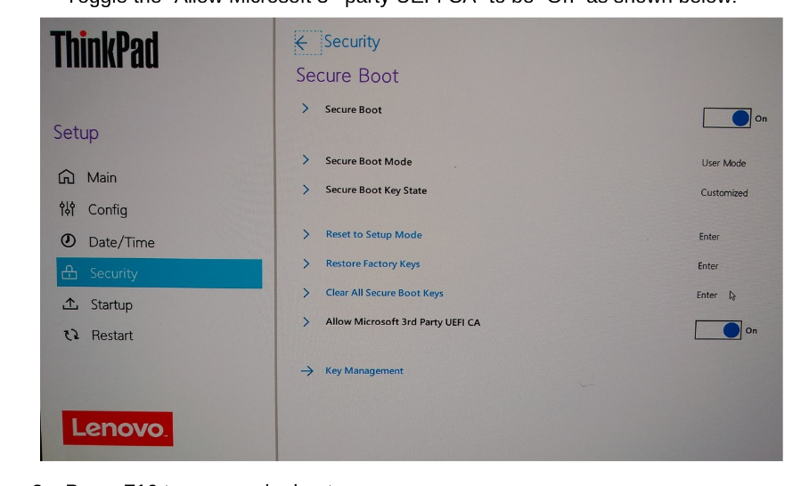

# Linux Installation
## Update System and BIOS
- Before getting rid of Windows, update the BIOS using Lenovo Vantage software. For more information, visit [Lenovo's website](https://support.lenovo.com/td/en/videos/vid500028-how-to-get-the-latest-drivers-and-bios-with-lenovo-vantage)

## Disable Bitlocker Encryption

Before installing Linux on your ThinkPad, you must check if Bitlocker encryption is enabled on your disk.

If BitLocker encryption is enabled, please disable it before following the below steps.

 

**You must disable bitlocker encryption to install Linux and backup your keys**

- [Lenovo Bitlocker Encryption Page](https://support.lenovo.com/us/en/solutions/ht506878)
- [Guide from Lenovo on how to disable bitlocker encryption](https://support.lenovo.com/us/en/solutions/ht515213-how-to-turn-off-bitlocker-in-windows-10-or-windows-11)
- [Guide from Its FOSS](https://itsfoss.com/dual-boot-ubuntu-windows-bitlocker/) - This guide also contains on how you can backup your recovery key

## Secure Boot
### What is Secure Boot?
> UEFI Secure boot is a verification mechanism for ensuring that code launched by firmware is trusted. More info can be found in the [Ubuntu Wiki](https://wiki.ubuntu.com/UEFI/SecureBoot)

### Enable Secure Boot

The Bitlocker recovery screen will appear on changing the BIOS settings.
Make sure you have bitlocker encrpytion disabled and have a backup key of your recovery key. The screen appeared for me because I hadn't disabled Bitlocker. 

Source of Instructions: [Lenovo](https://download.lenovo.com/pccbbs/mobiles_pdf/Enable_Secure_Boot_for_Linux_Secured-core_PCs.pdf)

1. Reboot your PC
2. Boot into the BIOS setup menu by pressing the F1 key when the Lenovo logo is displayed
3. In the BIOS menu select the “Security” option and the “Secure Boot” sub-menu. Toggle the “Allow Microsoft 3rd party UEFI CA” to be “On” as shown below.

4. Press F10 to save and reboot
## Linux Install
1. Flash the ISO on to a USB using Rufus, Balena Etcher or the software of your choice (Since I use Fedora, I used Fedora Media Writer)
2. Take your freshly written USB key and insert it in the powered down installation platform.
3. Power on the device and press F12 during early boot to enter the Boot Menu.
4. Navigate down to the USB HDD device and press Enter.
5. Select the appropriate option from the GRUB Menu (In my case it was *Test this media & start Fedora-Workstation-Live.*)